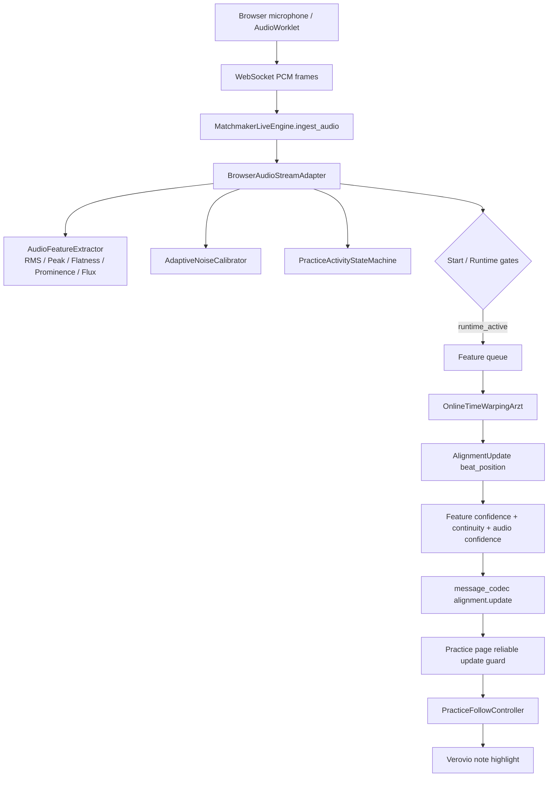
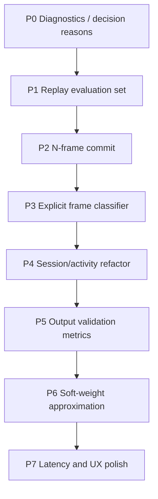

# 乐谱跟随系统优化与重构计划

## 目标

本文档基于当前代码实现和近期“敲击桌子导致乐谱持续跟随”的排查结果，制定下一阶段优化计划。目标不是推翻现有架构，而是在现有 Chroma + Matchmaker/Arzt OLTW 的基础上提升稳定性、可观测性和可维护性。

核心原则：

- 每一层都假设上一层会犯错，错误不能直接传播到 UI。
- 先补可观测性和回放评测，再做阈值和策略调优。
- 输入侧和输出侧都要有保护，但职责不同。
- 前端高亮必须比后端 raw alignment 更保守。
- 当前开发阶段不需要保留不必要的兼容逻辑。

## 当前实现摘要

当前乐谱跟随链路大致如下：

主要代码位置：

- 后端实时引擎：[backend/app/processing/engines/matchmaker_live.py](../../../backend/app/processing/engines/matchmaker_live.py)
- 音频活动特征与状态：[backend/app/processing/engines/practice_audio_activity.py](../../../backend/app/processing/engines/practice_audio_activity.py)
- WebSocket 消息编码：[backend/app/processing/realtime/message_codec.py](../../../backend/app/processing/realtime/message_codec.py)
- 前端页面 guard：[apps/customer-web/src/app/[locale]/(workspace)/score/[id]/practice/page.tsx](../../../apps/customer-web/src/app/%5Blocale%5D/(workspace)/score/%5Bid%5D/practice/page.tsx)
- 前端高亮控制器：[apps/customer-web/src/lib/practice/follow-controller.ts](../../../apps/customer-web/src/lib/practice/follow-controller.ts)
- 当前回放测试雏形：[backend/tests/test_practice_audio_replay_evaluation.py](../../../backend/tests/test_practice_audio_replay_evaluation.py)

## 当前已经具备的防线

1. 后端启动门控
   - 要求 RMS、Peak、tonal signal、peak prominence。
   - `PRACTICE_AUDIO_MIN_ACTIVE_FRAMES` 已提升到 3 帧安全下限。
   - 启动前 rejected 帧会清空 `start_streak`。
   - 启动前会通过首音 Chroma 相似度校验 `_is_valid_start_feature`。

2. 后端运行时活动判断
   - `runtime_active` 才会把特征帧喂给 OLTW。
   - 非活动时降低 `audio_confidence`，进入 `holding_decay` 或 `lost`。

3. 输出置信度审查
   - `visual_confidence = min(alignment_confidence, continuity_confidence, audio_confidence)`。
   - 通过当前 Chroma 特征与参考特征的相似度压低 `alignment_confidence`。

4. 前端可靠更新 guard
   - 只有 `match_state === "matched"`、`audio_active === true`、`visual_confidence >= 0.55` 的更新才会写入 `alignment`。

5. 前端基础连续性保护
   - `PracticeFollowController` 已有低置信拒绝、回退拒绝、大跳跃拒绝、顺序 clamp。

## 当前主要问题

### 1. 诊断字段还不够解释“为什么通过/拒绝”

日志已有 RMS、Peak、Flatness、Prominence、Flux、state，但缺少更直接的决策字段：

- `frame_class`: `silence | transient | tonal | uncertain`
- `start_reason`
- `reject_reason`
- `queue_decision`
- `feature_confidence`
- `beat_delta`
- `candidate_beat`
- `committed_beat`
- `commit_streak`

结果是每次问题都要从多个字段反推原因。

### 2. Frame classification 仍是隐式逻辑

目前 `AudioFeatureExtractor` 只输出 `tonal_signal` 和 `onset_signal`，`silence / transient / tonal / uncertain` 没有显式建模。`BrowserAudioStreamAdapter` 里把 start gate、runtime gate、session window 混在一起判断，后续继续调参会越来越难解释。

### 3. OLTW 输入策略现在偏硬过滤

当前只有 `runtime_active` 帧入队。这个短期内有助于阻止噪声驱动路径，但长期不应只依赖 hard gate。更成熟的方向是“软权重思想”的工程近似：

- tonal：正常驱动。
- weak tonal / sustain：保留或低风险驱动。
- transient：不直接驱动位置，或极低权重近似。
- silence：不驱动 UI，可维持状态。

由于 Matchmaker/Arzt OLTW 原生不一定支持 frame weighting，短期应通过 confidence ceiling、hold-last-position、commit window、feature attenuation 等外围机制近似，而不是直接修改 OLTW 内核。

### 4. 前端缺少真正的 N-frame commit

当前前端有低置信和跳跃 guard，但还不是严格的“连续 N 帧稳定候选才提交 UI”。这会让偶发的高置信 matched 帧仍有机会推进高亮。

### 5. 回放评测集太小

目前已有 `test_practice_audio_replay_evaluation.py`，但只是合成帧级测试，还不足以支撑企业级阈值调优。真实场景至少需要覆盖：

- 桌面敲击
- 键盘敲击
- 咳嗽/说话
- 空调/风扇噪声
- 真实钢琴强奏/弱奏
- staccato
- 踏板延音
- 长休止后恢复
- 播放录音回采
- 手机/电脑外放

### 6. `visual_confidence` 是有用但不够可解释

单一 final confidence 对前端简单，但排查时需要保留分解状态：

- `audio_state`
- `alignment_state`
- `continuity_state`
- `frame_class`
- `validation_reason`

最好的结构不是删除 `visual_confidence`，而是保留它作为 final signal，同时输出可诊断字段。

## 优先级任务计划

### P0：补齐 diagnostics 和决策原因

目标：先让每一次高亮更新、拒绝、启动、入队都有可解释原因。

任务：

1. 在 `AudioFrameFeatures` 增加：
   - `frame_class`
   - `audio_confidence`
   - `classification_reason`

2. 在 `BrowserAudioStreamAdapter._log_diagnostics()` 增加：
   - `frame_class`
   - `start_reason`
   - `reject_reason`
   - `queue_decision`
   - `feature_confidence` 如果可用

3. 在 `AlignmentUpdate` 和 `message_codec` 增加可选诊断字段：
   - `feature_confidence`
   - `beat_delta`
   - `audio_state`
   - `alignment_state`
   - `continuity_state`
   - `validation_reason`

4. 前端 debug 日志补充：
   - `match_state`
   - `audio_active`
   - `beat_delta`
   - `candidate index`
   - `commit streak`
   - reject reason

验收标准：

- 敲一次桌子后，仅看日志即可知道它被分类为什么、为何启动或拒绝、是否入队、为何前端更新或冻结。
- 不需要再人工从 RMS/Flatness/Prominence 多字段倒推原因。

建议测试：

- 更新 `backend/tests/test_practice_runtime_regressions.py`
- 更新 `backend/tests/test_practice_websocket_flow.py`
- 前端新增或扩展 follow-controller 单元测试，如果当前没有测试基础，先把 pure decision logic 抽成可测函数。

### P1：建立真实音频回放评测集

目标：停止只靠单次日志调阈值，把修复变成可重复验证。

任务：

1. 新建测试数据目录，例如：
   - `backend/tests/fixtures/practice_audio/positive/`
   - `backend/tests/fixtures/practice_audio/negative/`

2. 定义统一 metadata，例如 `manifest.json`：
   - `name`
   - `label`
   - `expected_start`
   - `expected_ui_updates`
   - `expected_false_update_max`
   - `notes`

3. 建立 replay harness：
   - 加载 wav/webm/pcm fixture。
   - 复用 `BrowserAudioStreamAdapter` 和后续 output validation。
   - 统计 false start、false follow、lost latency、recovery latency。

4. 初始 fixture 最少覆盖：
   - 桌面敲击 3 组
   - 键盘敲击 1 组
   - 静音/环境噪声 1 组
   - 钢琴强奏 1 组
   - 钢琴弱奏 1 组
   - 踏板延音 1 组

验收标准：

- 每次调整阈值或状态机前后都能跑同一批音频。
- Negative fixture 不允许启动或 UI 推进。
- Positive fixture 必须能启动，并在合理延迟内推进。

建议测试：

- 扩展 [backend/tests/test_practice_audio_replay_evaluation.py](../../../backend/tests/test_practice_audio_replay_evaluation.py)
- 加入 CI 可运行的小体积 fixture；大体积音频可后续拆分。

### P2：实现后端/前端 N-frame commit

目标：偶发高置信 matched 帧不能直接驱动 UI。

建议先在前端做，因为最小侵入、收益最大；后续再把 commit state 下沉到后端。

任务：

1. 在 `PracticeFollowController` 增加 commit buffer：
   - `pendingCandidateIndex`
   - `pendingBeat`
   - `pendingCount`
   - `lastCommittedIndex`

2. 只有连续 N 帧满足以下条件才 commit：
   - `match_state === "matched"`
   - `audio_active === true`
   - `visual_confidence >= threshold`
   - candidate index 单调或只前进 1 个 event
   - beat delta 在允许范围内

3. N 的初始值：
   - start/recovery：3
   - following 内连续顺序推进：2 或 3
   - desync recovery：3 到 5

4. UI 决策中区分：
   - raw candidate
   - pending candidate
   - committed candidate

验收标准：

- 单次或两次桌面敲击即使产生 matched update，也不能推进 UI。
- 正常连续演奏不会明显卡顿。
- 暂停/恢复后保留上一个 committed note。

建议测试：

- 为 follow-controller 抽出纯函数并添加测试：
  - single-frame matched 被 hold
  - 3-frame stable matched 被 commit
  - jump candidate 被 reject
  - low confidence streak 不清掉当前高亮

### P3：显式 Frame Classifier

目标：把当前隐式的 `tonal_signal/onset_signal` 发展成可解释的 frame classification。

任务：

1. 新增 `AudioFrameClass`：
   - `silence`
   - `transient`
   - `tonal`
   - `uncertain`

2. 新增 `FrameClassifier` 或扩展 `AudioFeatureExtractor`：
   - 输入 RMS、Peak、Flatness、Prominence、Flux、noise floor。
   - 输出 `frame_class`、`audio_confidence`、`reason`。

3. 建议初始规则：
   - silence：低于 adaptive noise floor。
   - tonal：flatness 低、prominence 高、持续或重复出现。
   - transient：flux/peak 高但持续短，或 prominence/flatness 不稳定。
   - uncertain：介于边界，不能直接启动或 commit。

4. `PracticeActivityStateMachine` 不再直接理解谱特征，只消费 frame classifier 结果。

验收标准：

- `transient` 不刷新 session window。
- `tonal` 和 weak tonal 能维持 following。
- `uncertain` 不直接启动，但可以用于 holding。
- 日志中明确显示 frame class。

建议测试：

- 合成 impulse 应为 transient。
- 低电平 sine 应为 tonal 或 weak tonal。
- 静音应为 silence。
- 边界信号应为 uncertain，不可启动。

### P4：拆分 Session Layer 和 Activity Confidence

目标：降低 `BrowserAudioStreamAdapter` 与 `PracticeActivityStateMachine` 的语义耦合。

当前问题：

- `BrowserAudioStreamAdapter.ingest()` 同时负责特征提取、校准、启动门控、状态转移、特征入队。
- `PracticeActivityStateMachine` 管 session state，但 start/runtime/onset 的语义仍散在 adapter 内。

任务：

1. 引入更清晰的对象边界：
   - `AudioFeatureExtractor`: 只计算。
   - `FrameClassifier`: 只分类和打分。
   - `SessionActivityTracker`: 管 armed/following/holding/lost。
   - `OltwInputPolicy`: 决定 queue / hold / attenuate。
   - `AlignmentValidator`: 输出 validation state 和 final confidence。

2. 保持当前 public API 不大改：
   - `MatchmakerLiveEngine.ingest_audio()` 不变。
   - WebSocket message 结构只做向后兼容的字段新增。

3. 删除或迁移 adapter 内的散落私有方法：
   - `_has_start_signal`
   - `_has_runtime_activity`
   - `_has_musical_start_spectrum`
   - `_update_runtime_activity`

验收标准：

- 每个类有单一职责。
- 调整 frame classification 不会影响 session state 代码。
- 调整 commit/window 不会影响特征提取代码。

### P5：增强 Output Validation

目标：让 OLTW 的 raw beat 必须经过更可解释的审查。

任务：

1. 增加 beat velocity：
   - 当前 beat 与上次 committed beat 的速度。
   - 异常快/异常慢降低 confidence 或进入 hold。

2. 增加 path stability 近似：
   - 如果 OLTW 无法直接给 path cost，可用最近 N 个 raw beat 的方差、反复跳动、delta 抖动近似。

3. 保留 feature similarity：
   - 当前 Chroma 与参考 Chroma 的相似度继续作为 alignment confidence 的重要输入。

4. 输出可解释状态：
   - `alignment_state`: `stable | jumpy | desynced | recovering`
   - `continuity_state`: `ok | jump | rollback | stalled`

验收标准：

- 1 到 2 拍的异常推进也能被识别，而不是只拦 4 拍以上大跳。
- recovery 需要连续稳定，不允许单帧恢复。

### P6：软权重思想的工程近似

目标：逐步从“硬过滤 OLTW 输入”过渡到更稳定的软权重近似。

注意：Matchmaker/Arzt OLTW 原生未必支持 frame weighting，所以不要优先改内核。

候选策略：

1. Hold-last-position：
   - transient / silence 时不提交新位置。
   - raw OLTW 可运行，但 UI commit 不动。

2. Feature attenuation：
   - 对 uncertain/transient 帧输入接近中性的特征，减少路径推动。
   - 需要实验验证，避免破坏正常跟随。

3. Confidence ceiling：
   - `audio_confidence` 严格压制 final confidence。

4. Queue policy 分级：
   - tonal：queue。
   - weak_tonal：queue 或低风险 queue。
   - transient：默认不 queue，等 P1/P2/P5 后再评估是否需要 attenuation。
   - silence：默认不 queue，但保持 session state。

验收标准：

- 不牺牲弱奏和踏板延音。
- 噪声不会驱动 UI。
- 回放评测集证明策略优于当前 hard gate。

### P7：延迟与用户体验优化

目标：在稳定性提升后，减少高亮滞后和交互误导。

任务：

1. 明确录音计时：
   - “点击开始”到“准备完成”的时间是否计入录音，需要 UI 文案明确。

2. 延迟补偿：
   - 估算 WebAudio buffer、WebSocket、frame_rate、OLTW 输出延迟。
   - 在 UI commit 时做小幅预测或补偿。

3. 优化准备文案：
   - 保持“准备好了，请弹奏第一个音符开始”与后端 armed 状态一致。

验收标准：

- 用户知道什么时候开始录音、什么时候开始跟随。
- 正常弹奏时高亮不明显滞后。

## 建议执行顺序

推荐先做 P0 和 P1，再继续调阈值。当前系统已经通过多轮补丁挡住了大部分桌面敲击误触发，但如果继续只靠日志追阈值，会很容易修一个 case 破坏另一个 case。

## 第一阶段可交付清单

第一阶段建议只做 P0 到 P2：

1. P0：补充 diagnostics 字段和 reason。
2. P1：建立最小真实音频回放集。
3. P2：实现前端 N-frame commit。

第一阶段完成后，应能回答：

- 每个输入帧被分成什么类型？
- 为什么启动或没有启动？
- 为什么入队或没有入队？
- 为什么 raw beat 被 commit 或被 hold？
- 敲桌子、弱奏、踏板延音在评测集上的指标分别是多少？

## 风险与注意事项

- 不要继续只加阈值。阈值没有评测集支撑时只是经验猜测。
- 不要把 transient 做成 session state。它是 frame 属性。
- 不要让前端直接处理太多状态组合。后端保留诊断字段，前端使用明确的 final decision。
- 不要立刻修改 OLTW 内核。先用外围机制近似 frame weighting。
- 不要把 `visual_confidence` 删除。它对前端简单有用，但必须补充可解释字段。

## 成功标准

短期成功标准：

- 桌面敲击不会启动跟随，不会推进 UI。
- 单帧/两帧偶发 matched 不会推进 UI。
- 正常钢琴起始音能在合理延迟内启动。
- 弱奏和踏板延音不会过早进入 lost。

中期成功标准：

- 每次改动都能通过固定回放评测集。
- diagnostics 能直接定位问题层级。
- frame classification、session state、output validation 可以分别测试和调参。

长期成功标准：

- 系统稳定性主要来自多层容错，而不是单个阈值。
- 新增场景时优先加入评测集，再调整策略。
- UI 始终只展示 committed alignment，而不是 raw OLTW output。
